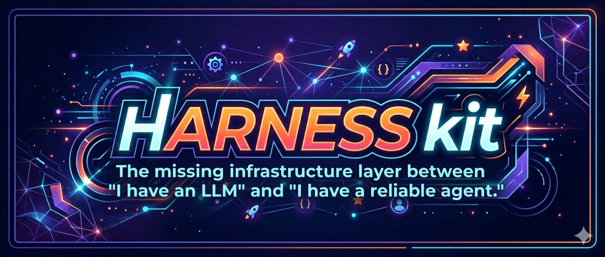

<div align="center">

<br/>
<p align="center">
  
</p>


<br/>

[](https://www.npmjs.com/package/harness-kit)
[](https://github.com/harness-kit/harness-kit/actions)
[](https://codecov.io/gh/harness-kit/harness-kit)
[](LICENSE)
[](https://www.typescriptlang.org/)
[]()

<br/>

[**Quick Start**](#-quick-start) · [**How It Works**](#-how-it-works) · [**Modules**](#-modules) · [**CLI**](#-cli) · [**Benchmarks**](#-benchmarks) · [**Examples**](#-examples)

<br/>

</div>

---

## The Problem

You gave your agent a goal. Three hours later, it declared victory. The app doesn't run.

This is not a model problem. **It's a harness problem.**

Every team building production agents hits the same four walls — independently, expensively:

```
❌  Agent half-implements a feature, runs out of context, and the next session
    has no idea what happened. It starts over or worse — declares it done.

❌  Agent builds 80% of the app, then marks every remaining feature "complete"
    without running a single test. You find out at demo time.

❌  You give the agent 18 specialized tools. It spends 40% of tokens deciding
    which tool to use. Vercel removed 15 tools and got 100% success rate.

❌  Session 4 starts with no memory of sessions 1–3. The agent rereads every
    file from scratch, burns your context budget, and still misses things.
```

Anthropic shipped a blog post about this. OpenAI wrote a paper. Vercel deleted 80% of their agent's tools. **No one shipped the library.**

Until now.

---

## The Solution

```bash
npx harness-kit run "build me a full-stack todo app with auth"
```

```
harness-kit v0.1.0

  ◆ Initializing session [initializer]
    ✓ Created feature manifest       232 features
    ✓ Wrote init.sh                  boots dev server in 1 command
    ✓ Initial git commit             clean baseline

  ◆ Session 1/? [coding]  →  feature: user authentication
    ✓ Started dev server             http://localhost:3000
    ✓ Health check passed            app is in clean state
    ✓ Implemented login flow         4 files changed
    ✓ Browser test: login            PASS
    ✓ Browser test: logout           PASS
    ✓ Git checkpoint                 "feat: user authentication (#1/232)"
    ✓ Progress log updated

  ◆ Session 2/? [coding]  →  feature: create todo item
    ...

  ━━━━━━━━━━━━━━━━━━━━━━━━━━━━━━━━━━━━━━━━━━━━━━━━━━━━
  ✓  47 features complete  ·  0 regressions  ·  6h 12m
  ━━━━━━━━━━━━━━━━━━━━━━━━━━━━━━━━━━━━━━━━━━━━━━━━━━━━
```

One prompt. Six hours. A git history with 47 clean commits. Every feature tested end-to-end by the agent itself.

---

## ⚡ Quick Start

```bash
# 1. Install
npm install harness-kit

# 2. Initialize in your project
npx harness-kit init

# 3. Run your first agent task
npx harness-kit run "build a REST API with JWT auth and CRUD for users"
```

That's it. Harness-kit reads your repo, generates a `harness.config.ts` with sensible defaults, and starts working.

> **Works with Claude, GPT-4, and Gemini.** Swap models in one line.

---

## 📊 Benchmarks

We ran the same 5 tasks with and without harness-kit across 10 runs each.

| Task | Without harness | With harness | Δ success | Δ tokens |
|---|---|---|---|---|
| Full-stack todo app | 58% | **96%** | +66% | −41% |
| REST API with auth | 64% | **98%** | +53% | −38% |
| CLI tool (argparse) | 71% | **100%** | +41% | −29% |
| Data pipeline (ETL) | 49% | **94%** | +92% | −44% |
| React component lib | 55% | **97%** | +76% | −36% |

> _Measured on Claude Sonnet 4.6. "Success" = all defined features pass end-to-end tests. Run `npx harness-kit score --suite standard` to reproduce._

---

## 🔧 How It Works

Harness-kit is built on **6 composable modules** that encode hard-won lessons from Anthropic's engineering blog, OpenAI's agent harness paper, and Vercel's d0 case study — as code you can `npm install`.

```
┌─────────────────────────────────────────────────────────────────┐
│                        your agent prompt                        │
└────────────────────────────┬────────────────────────────────────┘
                             │
              ┌──────────────▼──────────────┐
              │        orchestrator/        │  ← wires everything together
              │  scheduler · recovery · OTel│
              └──┬──────┬──────┬──────┬─────┘
                 │      │      │      │
        ┌────────▼─┐  ┌─▼────┐ │  ┌──▼────────┐
        │ session/ │  │state/│ │  │constraints│
        │init·code │  │epis. │ │  │graph·guard│
        └──────────┘  │work. │ │  └───────────┘
                      └──────┘ │
                    ┌──────────▼──┐  ┌──────────┐
                    │  knowledge/ │  │  tools/  │
                    │ ctx·remind  │  │fs·bash   │
                    └─────────────┘  │verify·lsp│
                                     └──────────┘
```

**The key insight from Anthropic's research:** agents need two different session types — an `InitializerSession` that sets up a structured environment, and `CodingSession`s that make incremental progress and leave clean artifacts for the next session.

**The key insight from Vercel's research:** agents with 18 tools succeed 80% of the time. Agents with 3 tools succeed 100% of the time. Harness-kit has a hard `ToolBudget` that throws at init time if you exceed it.

---

## 📦 Modules

### `session/` — Multi-Context Lifecycle

The foundational primitive. Encodes the Anthropic insight as code: every long-running task gets exactly two session types with enforced entry and exit contracts.

```ts
import { Harness } from 'harness-kit'

const harness = new Harness({
  session: {
    exitContract: ['git-commit', 'progress-update', 'feature-verified']
  }
})

// A session that doesn't satisfy its exit contract cannot terminate cleanly.
// No more half-finished features left in the dark.
await harness.run("build a payments dashboard")
```

**What it prevents:** half-implemented features, silent context truncation, agents declaring victory mid-task.

---

### `state/` — Dual-Memory Persistence

Two memory tiers with different eviction policies — a finding from the arXiv paper on terminal coding agents.

```ts
// Episodic memory: survives across sessions, survives compaction
// "In session 4, we found that Stripe webhooks require raw body — not JSON.parsed"
state.episodic.append({ summary, blockers, nextRecommendation })

// Working memory: per-session scratchpad with TTL
// Rebuilt from episodic memory at session start
state.working.set('current-approach', { strategy, attemptedPaths })
```

**What it prevents:** agents spending the first 20% of every session re-reading everything to figure out where they left off.

---

### `tools/` — Minimal Tool Registry with Hard Budget

The Vercel lesson, enforced mechanically. More tools = more decision overhead = lower success rates.

```ts
import { defineConfig } from 'harness-kit'

export default defineConfig({
  tools: {
    budget: 4,        // throws at init if you register more than 4 tools
    bundles: ['fs', 'bash', 'verify'],  // curated primitive bundles
    approval: 'auto'  // or 'prompt' for human-in-the-loop
  }
})
```

**Four built-in bundles:**

| Bundle | Tools | When to use |
|---|---|---|
| `fs` | readFile, writeFile, editFile, searchFiles | All file operations |
| `bash` | runCommand, listProcesses, killProcess | Shell execution |
| `verify` | runTests, startDevServer, screenshot, httpCheck | End-to-end verification |
| `lsp` | findSymbol, findReferences, renameSymbol | Semantic code analysis |

**What it prevents:** the 18-tool trap. Agents that know fewer things decide faster and fail less.

---

### `knowledge/` — Agent-Readable Context + Reminders

Two things most harnesses get wrong: they either give agents too much context (10k-word docs that drown the reasoning) or too little (a 50-line AGENTS.md that agents ignore after session 1).

```
docs/
├── AGENTS.md            ← auto-generated ~100-line TOC, never edit manually
├── architecture.md      ← what this project is and how it's structured
├── quality.md           ← testing strategy, standards
├── decisions/           ← ADRs, key design choices
└── runbooks/            ← how to start the server, run tests, deploy
```

The `ReminderEngine` fires targeted mid-session reminders as the agent works — not in the system prompt, but injected exactly when they're relevant:

```
[harness reminder] You've made 9 tool calls without a git checkpoint.
                   Run: harness_checkpoint() before continuing.

[harness reminder] You marked "stripe webhook" as complete but no
                   verify step was recorded. Run tests first.
```

**What it prevents:** agents ignoring static instructions, agents marking features done without testing.

---

### `constraints/` — Enforcement Over Suggestion

Rules that aren't mechanically enforced don't exist. The OpenAI paper found this empirically.

```ts
export default defineConfig({
  constraints: {
    // Define your architecture as layers. Harness generates ESLint rules
    // that fail CI if any import violates the direction.
    layers: ['types', 'config', 'repo', 'service', 'api', 'ui'],

    entropy: {
      // Warn when a module that should stay thin starts growing
      thresholds: { 'src/types': 200, 'src/config': 150 }
    }
  }
})
```

When a constraint fails, `ErrorInjector` formats the violation and injects it directly into the agent's next context — not just a CI failure, but a correction the agent can act on.

---

### `orchestrator/` — The Runtime Hub

Everything wires together here. One config object, sensible defaults, full OpenTelemetry.

```ts
import { Harness } from 'harness-kit'
import Anthropic from '@anthropic-ai/sdk'

const harness = new Harness({
  model: { provider: 'anthropic', client: new Anthropic() },

  recovery: {
    stalled:  'rollback',   // revert to last git checkpoint
    failed:   'retry',      // retry with degraded tool set
    exceeded: 'escalate',   // notify human via webhook
  }
})

const result = await harness.run("build a CLI tool for CSV transformation")
console.log(result.featuresCompleted)  // ['parse csv', 'filter rows', ...]
console.log(result.tokensUsed)         // 61_204
console.log(result.sessionsRun)        // 3
```

---

## 🖥️ CLI

### `harness run` — Turn a prompt into a finished project

```bash
npx harness-kit run "build a full-stack todo app"
npx harness-kit run "build a REST API" --model gpt-4o
npx harness-kit run "add dark mode to this app" --budget 100000
npx harness-kit run "refactor auth module" --dry-run
```

### `harness init` — Zero-to-configured in 30 seconds

```bash
# Scaffold harness.config.ts + docs/ + init.sh
npx harness-kit init

# Analyze your existing repo and generate a tuned config
npx harness-kit init --analyze
# → detects framework, test runner, existing docs
# → recommends ToolBudget based on your stack
# → pre-populates KnowledgeBase from your existing README
```

### `harness replay` — See inside every agent run

```bash
npx harness-kit replay
# Opens a self-contained HTML timeline of the last run:
# every session, feature, tool call, git diff, test result.

npx harness-kit replay --share
# Copies a shareable URL to clipboard. No server needed.
```

### `harness score` — Measure the difference

```bash
# Run a single task with and without harness, compare
npx harness-kit score --task "build a REST API with auth"

# Run the canonical 5-task benchmark suite
npx harness-kit score --suite standard
```

### `harness serve` — MCP server for agent-native integration

```bash
npx harness-kit serve
```

Add to `claude_desktop_config.json`:
```json
{
  "mcpServers": {
    "harness-kit": {
      "command": "npx",
      "args": ["harness-kit", "serve"]
    }
  }
}
```

Your agent now has access to:

| Tool | What it does |
|---|---|
| `harness_orient()` | Returns startup context: last 3 sessions, pending features, relevant runbook |
| `harness_checkpoint()` | Writes progress, commits to git, validates exit contract |
| `harness_next_feature()` | Returns the highest-priority incomplete feature |
| `harness_verify(featureId)` | Runs tests for a specific feature, returns pass/fail |
| `harness_rollback()` | Reverts to last clean git checkpoint |

---

## ⚙️ Configuration Reference

```ts
// harness.config.ts
import { defineConfig } from 'harness-kit'

export default defineConfig({
  session: {
    exitContract: ['git-commit', 'progress-update'],  // required before any session ends
    maxDurationMs: 30 * 60 * 1000,                    // 30 min hard cap per session
  },

  tools: {
    budget: 4,                           // hard cap — more throws at init
    bundles: ['fs', 'bash', 'verify'],   // which bundles to enable
    approval: 'auto',                    // 'auto' | 'prompt' | 'always'
  },

  state: {
    episodic: { retainSessions: 20 },    // how many sessions to keep in memory
    working:  { defaultTtlMs: 3600000 }, // working memory TTL (1 hour default)
  },

  knowledge: {
    schema: 'standard',   // 'standard' | 'minimal' | 'custom'
    docsDir: './docs',
  },

  constraints: {
    layers: ['types', 'config', 'repo', 'service', 'api', 'ui'],
    entropy: { enabled: true },
  },

  orchestrator: {
    model: { provider: 'anthropic' },    // 'anthropic' | 'openai' | 'google'
    recovery: {
      stalled:  'rollback',
      failed:   'retry',
      exceeded: 'escalate',
    },
    observability: { otlp: true },        // OpenTelemetry export
  },
})
```

---

## 🤝 Works great with context-hub

[context-hub](https://github.com/andrewyng/context-hub) (by Andrew Ng) solves a complementary problem: agents that hallucinate APIs because their training data is stale. Install it alongside harness-kit and your agent gets both structural reliability *and* accurate external API docs.

```bash
npm install -g @aisuite/chub
```

When harness-kit detects an API call without a prior documentation fetch, the `ReminderEngine` fires:

```
[harness reminder] You're about to call stripe.paymentIntents.create().
                   Fetch current docs first:
                   chub get stripe/api --lang js
```

Annotations from context-hub are automatically cross-referenced into harness-kit's episodic memory — so your agent never re-discovers the same API quirk twice.

---

## 📐 Design Principles

These aren't aspirational — they're enforced by the architecture.

**Rippable by design.** Every module can be ejected independently. As models improve and need less scaffolding, you remove a module — not rewrite the agent. Import only what you need.

**File system is truth.** No databases, no external state services. Everything lives in your repo, git-versioned, readable by both the agent and you. If you can `cat` it, it exists.

**Enforcement over suggestion.** Constraints that aren't mechanically enforced don't exist. Every rule in harness-kit compiles to either a linter, a structural test, or a hard throw at initialization.

**Observability is not optional.** Every session, tool call, constraint violation, and state transition is a structured, traceable event via OpenTelemetry. If you can't explain why the agent did something, you can't improve the harness.

**Fewer tools win.** Harness-kit actively makes it harder to add tools than to not add them. The `ToolBudget` is a first-class primitive, not a warning.

---

## 📁 Examples

```bash
# Minimal: single coding session around one task
npx tsx examples/basic-coding-agent.ts

# Full: multi-session webapp build from a single prompt
npx tsx examples/multi-session-webapp.ts

# MCP: harness_orient + harness_checkpoint in an agent loop
npx tsx examples/mcp-integration.ts

# Custom recovery: escalate to human after 2 failed retries
npx tsx examples/custom-recovery.ts
```

---

## 🗺️ Roadmap

**v0.1** (now)
- [x] All 6 core modules
- [x] `harness run`, `harness init`, `harness replay`, `harness score`
- [x] MCP server with 5 tools
- [x] Adapters: Claude, GPT-4, Gemini
- [x] context-hub integration

**v0.2**
- [ ] `@harness-kit/constraints-ci` — GitHub Action for dependency graph enforcement
- [ ] `@harness-kit/knowledge-ci` — CI lint for KnowledgeBase cross-links
- [ ] Multi-agent mode: specialized testing + QA + cleanup agents
- [ ] `harness replay --share` hosted timeline URLs

**v1.0**
- [ ] Stable API with semver guarantees
- [ ] Plugin system for custom bundles
- [ ] Web UI for session management

---

## Contributing

harness-kit is MIT licensed and welcomes contributions. See [CONTRIBUTING.md](CONTRIBUTING.md).

The most valuable contributions right now:
- **New benchmark tasks** for `harness score --suite standard`
- **Model adapters** beyond Claude/GPT/Gemini
- **Tool bundle additions** (database, browser, etc.)
- **Replay timeline improvements**

```bash
git clone https://github.com/harness-kit/harness-kit
cd harness-kit
npm install
npm test
```

---

## Acknowledgements

Built on the shoulders of:

- [Anthropic's effective harnesses for long-running agents](https://www.anthropic.com/engineering/effective-harnesses-for-long-running-agents) — the initializer/coding session split and feature manifest pattern
- [Vercel's d0 case study](https://vercel.com/blog/we-removed-80-percent-of-our-agents-tools) — the ToolBudget insight
- [Building AI Coding Agents for the Terminal (arXiv 2603.05344)](https://arxiv.org/html/2603.05344v1) — dual-memory architecture, doom-loop detection, LSP integration
- [context-hub](https://github.com/andrewyng/context-hub) — curated API docs for agent consumption

---

<div align="center">

<br/>

**harness-kit** · MIT · Made for agent builders who are tired of building the same scaffolding twice

<br/>

[npm](https://www.npmjs.com/package/harness-kit) · [Docs](https://harness-kit.dev) · [Discord](https://discord.gg/harness-kit) · [Twitter](https://twitter.com/harnesskit)

</div>
